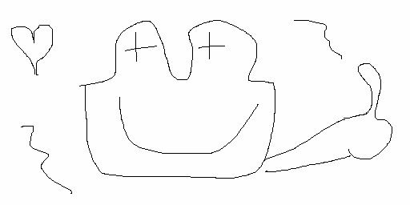

# bmp_life

**bmp_life** is a console-based program that processes a monochrome BMP image as the initial state of Conway's Game of Life. It generates new generations of the game and saves them as BMP files. The program also supports optional visualization of the generations in the console.

---

## 🖼 What is BMP?

BMP (Bitmap Picture) is a bitmap image storage format. It represents images as a grid of pixels, which makes it ideal for Conway's Game of Life simulations.

---

## 🎮 What is Conway's Game of Life?

Conway's Game of Life is a cellular automaton based on the following rules:

1. Any live cell with two or three neighbors survives.
2. Any dead cell with exactly three live neighbors becomes a live cell.
3. All other cells die or remain dead.

---

## 🛠 Program Features

- **BMP Image Processing**: Converts BMP pixels into an array of `0`s and `1`s for simulation.
- **Game Generation**: Simulates new generations of Conway's Game of Life based on the initial array.
- **BMP Output**: Saves each new generation as a BMP file in the specified directory at a defined frequency.
- **Console Visualization**: Optionally visualize the generations directly in the terminal.

---

## 🚀 Build Instructions

### For Unix-based Systems

1. Clone the repository and navigate to the project directory:
   ```bash
   git clone <repository_url>
   cd bmp_life
   ```

2. Build the program using `cmake`:
   ```bash
   cmake . && make
   ```

---

## ⚡ How to Run

### Command-Line Arguments

Run the program using the following syntax:

```bash
./bmp_life --input <path_to_bmp> --output <path_to_output_dir> --max_iter <max_iter_count> --show
```

### Parameters:

- `--input <path_to_bmp>`: **(Required)** Path to the initial BMP image.
  - Example: `--input start.bmp`
  
- `--output <path_to_output_dir>`: **(Required)** Directory to store the generated BMP files.
  - Example: `--output generations/`
  
- `--max_iter <max_iter_count>`: Maximum number of generations to simulate. *(Optional, default: 50)*  
  - Example: `--max_iter 100`
  
- `--show`: Enables console visualization of the generations. *(Optional)*

---

## 📂 Output Structure

- Generated BMP files are stored in the specified output directory.
- Each file is named sequentially:
  ```
  generation_01.bmp, generation_02.bmp, ...
  ```
- When `--show` is enabled, the terminal displays each generation in real-time.

---
